# public-doc-to-hwpx

> **AI 콘텐츠를 공공기관 표준 보고서로 다듬어 HWPX·메일 본문으로 변환하는 Claude Skill**
> 한 문장 한 줄, 개조식, 두괄식 — AI가 없던 시절 한글(hwp)을 쓰던 베테랑 보고서 작성자가 만든 것처럼.

[](https://opensource.org/licenses/MIT)
[](https://www.python.org/)
[](https://www.hancom.com/)

---

## 왜 만들었나

대부분의 AI 문서 자동화 도구는 **양식**(서식·레이아웃) 자동화에 집중합니다.
하지만 공공기관에서 평생 보고서를 써온 분들이 늘 강조하는 건 다른 부분입니다.

> "보고서는 30초 안에 핵심을 파악할 수 있어야 한다."
> "한 문장에 두 개 이상의 정보가 들어가면 다시 읽게 된다."
> "`-적`, `의`, `것`, `들` — 빼도 의미가 살아나면 빼라."

이 스킬은 **약 20여 년의 공공기관 근무 경력을 가진 직원의 보고서 작성 노하우**를
실제 강의자료와 우수예시에서 추출하여, AI가 자동으로 글을 다듬어주는 도구로 구현했습니다.

XML 빌드보다 **글쓰기 품질**을 먼저 생각하는 것이 이 스킬의 핵심입니다.

---

## 스킬 작동 구조 (v3.4.0 — 공공기관 문서서식 유지 방식)



### 핵심 변화 (v3.4.0)

이전의 4단계 워크플로우는 v3.4.0에서 **공공기관 특유의 문서서식을 그대로 유지하는 6단계 파이프라인**으로 개선되었습니다.
표·테두리·음영·결재선·페이지헤더 등 **양식의 시각 디자인은 손대지 않고, 내용만 슬롯에 채워 넣는 방식**입니다.

| 단계 | v3.0.1까지 | v3.4.0+ (개선사항) |
|------|-----------|------------------|
| 1. 입력 | 마크다운/PDF 파싱 | (동일) |
| 2. 양식 | 4개 양식 중 선택 | (동일) |
| 3. 콘텐츠 다듬기 | 글쓰기 최적화 규칙 적용 | **Author 가이드 참조** (원칙·구조·규칙 명확화) |
| 4. 값매핑 | 콘텐츠 → 슬롯 직접 매핑 | **표준 매핑 문서화** (양식별 슬롯 정의 파일) |
| 5. 빌드 파이프라인 | 처음부터 XML 생성 | **공공기관 문서서식 유지** — 양식의 표·테두리·음영 그대로, 슬롯에만 콘텐츠 삽입 |
| 6. 출력 | (동일) | (동일) |

### 공공기관 문서서식 유지 방식의 장점

- ✅ **양식 디자인 100% 보존** — 한글(hwp)의 표, 테두리, 음영, 결재선, 페이지헤더 모두 그대로 유지
- ✅ **공공기관 표준 양식 그대로** — 부서 양식·결재 라인·로고가 흐트러지지 않음
- ✅ **외부 의존성 제거** — 표준 양식 파일을 스킬에 동봉 (python-hwpx 라이브러리 불필요)
- ✅ **메타파일 자동 보정** — 한컴 표준 준수 메타파일 7종을 그대로 사용
- ✅ **회귀 테스트 완료** — 4개 양식 빌드 + 메타파일 일치 + HWP 식별 모두 검증

---

## 이전 워크플로우 (v3.0.1)

```
┌──────────────────────────────────────────────────────────────────┐
│                                                                  │
│   ① 콘텐츠 정리        ②  양식 결정       ③  콘텐츠 매핑      ④ 레이아웃 최적화      │
│   ─────────         ─────────       ─────────         ─────────         │
│   md/docx/pdf/txt    참조 hwpx 우선     필수항목 매핑       적/의/것/들 정리         │
│   파싱 + 구조화      4개 양식 자동추천   누락 시 ※AI 플래그   한 문장 한 줄 점검       │
│                                                       페이지 걸침 점검         │
│                                                                  │
└──────────────────────────────────────────────────────────────────┘
                                  │
                                  ▼
                       ┌──────────────────┐
                       │   ⑤ HWPX 빌드      │
                       │ (이메일은 .md)     │
                       └──────────────────┘
```

---

## 4개 양식 비교

| 양식 | 분량 | 독자 | 출력 | 글머리 위계 | 핵심 특징 |
|------|------|------|------|-------------|----------|
| **`format_1p`** | A4 1쪽 강제 | 의사결정자 | `.hwpx` | □ ○ - * | 두괄식 음영 박스 + 핵심 항목만 |
| **`format_full`** | A4 5–30쪽 | 상급자·관계부서 | `.hwpx` | Ⅰ. 1. 가. (1) | 표지 + 목차 + 보고요약 + 본문 + 별첨 |
| **`format_gongmun`** | A4 1–3쪽 | 외부기관·일반국민 | `.hwpx` | 1. 가. 1) (1) | 수신·제목·본문·발신명의 형식 엄수 |
| **`format_email`** | 200–500자 | 협업자 | `.md`/`.txt` | □ - * | 두괄식 결론 + 기한 명시 (메일 본문 복붙용) |

---

## 가장 빠른 사용법 (one-shot)

```bash
git clone https://github.com/<your-username>/public-doc-to-hwpx.git
cd public-doc-to-hwpx

# 1페이지 보고서 빌드
python3 scripts/compose_doc.py input.md output.hwpx \
  --format format_1p \
  --meta meta.json \
  --report-path /tmp/optimization_report.md
```

### `input.md` 예시

```markdown
# ○○기관 협력사업 실무협의 보고

## 추진배경
- 한국을 대표하는 공기업과 중소기업과의 상호 협력
- 판로 개척 어려운 중소기업의 전시·판매 통한 국가경제 발전

## 추진경과
- (6.15. ○○기관 유선협의)
  - ○○공사에서 중소기업 제품 판로개척 노력에 감사
  - 향후 MOU 등 적극 의사표명

## 향후계획
- MOU 체결에 따른 세부사항 협의 : '12. 6월
- MOU 체결 : '12. 7월
```

### `meta.json` 예시

```json
{
  "subtitle": "- ○○공사와 중소기업 상생협력을 위한 -",
  "author": "○○○처장 ○○○",
  "date": "'25.11.",
  "phone": "4315"
}
```

### 결과

- `output.hwpx` — 한글에서 바로 열리는 1페이지 보고서
- `optimization_report.md` — 자동 적용·검토 권장 사항 리포트

---

## 글쓰기 자동 변환 (★ 핵심 차별점)

`layout_optimizer.py` 가 다음을 **자동 적용**합니다.

### 신뢰도 높음 — 자동 적용

| 변환 전 | 변환 후 |
|---------|---------|
| `~와 관련된 ~` | `~ 관련 ~` |
| `~할 예정이었으나 이를 유예하였습니다` | `~ 예정 → 유예` |
| `여러/많은/각/모든/수많은/대부분의/다양한 ~들` | (들 제거) |

### 신뢰도 중간 — 검토 권장으로 표시

- `~할 것으로 보입니다` → `~ 예상 / ~ 전망`
- `~한 것으로 판단됩니다` → `~ 판단 / ~로 보임`
- `~하는 것이 필요합니다` → `~가 필요합니다`
- `~에 대한`, `~ 중 하나인`, `~의 ~의 ~` (의 연쇄)
- `사회적/경제적/정치적/행정적/조직적` + 명사
- 한 문장 46자 초과 (분리 후보)

### Before / After 예시

**Before** (66자, 정보 3개 혼재):
> 라마단 종료에 따라 중동항로의 거래량과 적재율 회복이 예상되며, 라마단 직전 적재율은 95% 수준이었고, 선사협의체는 성수기 할증료 부과를 유예하였습니다.

**After** (개조식 변환):
```
- 라마단 종료 → 중동항로 거래량·적재율 회복 예상
- 라마단 직전 적재율: 약 95%
- 성수기 할증료(USD 300/TEU) 부과 유예
```

---

## 디렉토리 구조 (v3.6.11)

```
public-doc-to-hwpx/
├── SKILL.md                                   # 6단계 워크플로우 + Critical Rules 23개 (Claude Skill 진입점)
├── README.md                                  # 이 파일
├── LICENSE                                    # MIT
├── CHANGES.md                                 ★ v3.6.11 — 사용자용 누적 변경 요약 (통합본)
├── RELEASE_CHECKLIST.md                       ★ v3.6.11 — 버전 업데이트 시 갱신 파일 체크리스트
├── PUSH_GUIDE.md                              # GitHub 푸시 워크플로우 안내
│
├── scripts/                                   ★ v3.6.11 — 공공기관 문서서식 유지 + 양식별 핫픽스 빌드
│   │
│   │  [핵심 빌더]
│   ├── fill_skeleton.py                       메인 빌더 — 양식 슬롯에 콘텐츠 값 삽입
│   ├── make_skeleton.py                       새 양식 등록 시 hwpx → 슬롯 토큰화 변환
│   ├── build_full.py                          ★ v3.5.0 — 풀버전 통합 빌드 워크플로우 (4대 함정 검사)
│   ├── fix_namespaces.py                      ⚠️ 필수 후처리 (빠뜨리면 한글에서 안 열림)
│   ├── validate.py                            구조 검증
│   │
│   │  [페이지 처리]
│   ├── simulate_pages.py                      ★ v3.5.0 — 페이지 시뮬레이션 + 목차 페이지번호
│   ├── ensure_body_anchor.py                  풀버전 본문 시작 pageBreak="1" 강제
│   │
│   │  [v3.6.x 양식별 핫픽스]
│   ├── wrap_long_titles.py                    ★ v3.6.0/3.6.4 — 표지·공문 제목 자간 압축 자동 해소
│   ├── fix_toc_dots.py                        ★ v3.6.1/3.6.2/3.6.5 — 목차 점선 width 42000 통일 + 캐시 제거
│   ├── fix_gongmun_body.py                    ★ v3.6.3 — 공문 본문 자간 압축 자동 해소
│   ├── split_gongmun_paragraphs.py            ★ v3.6.4/3.6.6 — placeholder 강제 분리
│   ├── fix_skeleton_defects.py                ★ v3.6.6/3.6.10 — Skeleton 양식 결함 자동 보정
│   ├── expand_gongmun_body.py                 ★ v3.6.7~3.6.10 — 공문 본문 위계 동적 확장
│   └── normalize_1p_markers.py                ★ v3.6.11 — 1p 보고서 마커(◦/-/*) 자동 정규화
│
├── templates/
│   ├── _skeleton.hwpx                         폴백 베이스 (한컴 표준 메타파일 준수)
│   ├── charpr_mapping.json                    양식별 charPr 역할 → id 매핑표
│   ├── government/header.xml                  관공서 charPr/paraPr/borderFill 정의
│   │
│   ├── format_1p/
│   │   ├── standard.hwpx                      1p 보고서 표준 양식 (맑은 고딕, 35개 슬롯)
│   │   ├── skeleton.hwpx                      슬롯 양식 (35개 슬롯)
│   │   ├── skeleton_mapping.json              슬롯 ↔ 원본 텍스트 매핑
│   │   └── outline_guide.md                   ★ v3.3.1 보고 목적별 11가지 표준 목차
│   │
│   ├── format_full/
│   │   ├── standard.hwpx                      풀버전 보고서 표준 양식 (맑은 고딕, 표 10개)
│   │   ├── skeleton.hwpx                      슬롯 양식 (127개 슬롯 + 페이지번호)
│   │   └── skeleton_mapping.json              슬롯 ↔ 원본 텍스트 매핑
│   │
│   ├── format_gongmun/
│   │   ├── standard.hwpx                      시행문 표준 양식 (굴림체, 표 셀 66개)
│   │   ├── skeleton.hwpx                      슬롯 양식 (27개 슬롯 — fwSpace 포함)
│   │   └── skeleton_mapping.json              슬롯 ↔ 원본 텍스트 매핑
│   │
│   └── format_email/                          (이메일은 텍스트만, 양식 불필요)
│
├── references/                                Claude가 작업 중 참조하는 Author 가이드 7개
│   ├── writing-principles.md                  ★ 보고서 작성 원칙 (강의자료 + 사례 통합)
│   ├── layout-rules.md                        ★ 레이아웃 최적화 규칙
│   ├── format-selection.md                    양식 선택 결정트리
│   ├── format-1p.md                           1p 보고서 가이드
│   ├── format-full.md                         풀버전 보고서 가이드
│   ├── format-gongmun.md                      시행문 가이드
│   └── format-email.md                        이메일 가이드
│
├── examples/                                  예시 values.json
│   ├── example_values_1p.json                 ★ v3.6.11 — 1페이지 보고서 예시 (마커 입력 자유)
│   ├── example_values_gongmun.json            시행문 예시 (모든 7개 위계 활용)
│   └── example_values_full.json               풀버전 보고서 예시 (127슬롯)
│
└── assets/
    └── public_doc_to_hwpx_skill_pipeline.svg  작동 구조 설명 다이어그램
```

---

## Claude Skill로 설치

이 리포지토리는 [Claude Skill](https://docs.claude.com/) 형식을 따르며, Claude·Cursor·Codex 등에서 사용 가능합니다.

### Claude Desktop / Web

```bash
# 1. 사용자 스킬 디렉토리에 복사
cp -r public-doc-to-hwpx ~/.claude/skills/

# 2. Claude 재시작 후, 자연어로 호출
"매출 실적 보고서 1페이지로 작성해줘"
"이 내용을 시행문 양식으로 hwpx 만들어줘"
```

### Cursor / Codex

`.cursor/rules` 또는 `AGENTS.md` 에 다음 추가:

```yaml
description: HWPX 보고서 작성 시 public-doc-to-hwpx v3 사용
globs: ["*.hwpx", "*.md", "*.docx"]
---
1. SKILL.md 의 4단계 워크플로우를 따른다
2. compose_doc.py 한 번으로 빌드 + 후처리 + 검증 자동
3. layout_optimizer 의 검토 권장 사항을 사용자에게 항상 표시
4. 1p 양식 1쪽 초과 시 풀버전 변경 권고 (자동 변경 금지)
```

---

## 작성 원칙

> **업무용 글쓰기의 본질 = 문제해결.**
> 보고서의 구조 = 문제해결 프로세스 그 자체.
>
> 약 20여 년의 공공기관 근무 경력을 가진 직원의 「업무용 글쓰기」 강의자료(전 25페이지) + 우수예시 모음을 학습하여 도출한 글쓰기 원칙을 자동 적용합니다.

상세 가이드: [`references/writing-principles.md`](references/writing-principles.md) · [`references/layout-rules.md`](references/layout-rules.md)

### 1. 보고서 논리 패턴 — Why → How → What

```
시작(Why)    → 왜 이 사업/보고를 하는가?      [제목 · 개요 · 추진배경]
중간(How)    → 어떻게 해결할 것인가?           [현황 · 문제점/원인 · 해결방안]
마무리(What) → 무엇을 결정/판단할 것인가?       [기대효과 · 조치사항 · 추진계획]
```

필수 항목이 누락되면 `※ AI 보완 필요` 플래그가 표시됩니다.

### 2. 두괄식 — 첫 3줄에 핵심을

- 개요는 결론·요약을 **첫 3줄 이내**에 압축
- 1페이지 보고서는 **음영 박스(요약문)** 에 보고 목적을 1–2줄로 압축해 맨 앞에 배치
- 의사결정자가 **30초 안에 읽고 판단**할 수 있도록 핵심부터 전달

### 3. 개조식 — 키워드·항목 중심

> **가독성이 높은 개조식 문체로 간결하게 기술하는 것이 원칙.**

- 글머리·번호로 끊어서 키워드 중심 서술
- 부가해설 없이 사실만 나열
- 서술식은 시행문 본문 도입부에서만 사용
- **서술식 → 개조식 자동 변환** 예시:

  Before (66자, 정보 3개 혼재):
  > 라마단 종료에 따라 중동항로의 거래량과 적재율 회복이 예상되며, 라마단 직전 적재율은 95% 수준이었고, 선사협의체는 성수기 할증료 부과를 유예하였습니다.

  After:
  - 라마단 종료 → 중동항로 거래량·적재율 회복 예상
  - 라마단 직전 적재율: 약 95%
  - 성수기 할증료(USD 300/TEU) 부과 유예

### 4. 「적의를 보이는 것들」 4종 — 빼야 할 군더더기

> 빼도 의미가 유지되면 빼는 것이 원칙. `layout_optimizer.py` 가 자동 점검·경고합니다.

| # | 표현 | 어색함 | 자연스러움 |
|---|------|--------|-----------|
| 1 | 접미사 `-적` | 사회**적** 현상 | 사회 현상 |
| 2 | 조사 `의` | 매출**의** 감소 | 매출 감소 |
| 3 | 의존명사 `것` | 검토하는 **것이** 필요합니다 | 검토가 필요합니다 |
| 4 | 복수 표현 `들` | 여러 사람**들** | 여러 사람 |

특히 `의`가 한 문장에 2번 이상 나오면 반드시 점검 대상.

### 5. 문장 줄이기 5원칙

**5-1. 한 문장 한 핵심** — 한 문장에 두 개 이상의 정보가 있으면 분리

**5-2. 한 문장 한 줄** — 본문 한 줄 ≈ 35–45자. 46자 초과 시 자동 분리 후보

**5-3. 제목은 명사형으로 짧게** — 제목은 문장이 아니라 **검색어**처럼

| 긴 제목 | 짧은 제목 |
|---------|-----------|
| 중동 항로와 관련된 특이사항 | 중동항로 특이사항 |
| 매장 운영의 효율성 제고 방안 | 매장 운영 효율화 방안 |
| 신규 사업의 추진의 필요성 | 신규사업 추진 필요성 |

**5-4. 판단·예정 표현 압축**

| 길게 | 짧게 |
|------|------|
| ~할 것으로 보입니다 | ~ 예상 / ~ 전망 |
| ~한 것으로 판단됩니다 | ~ 판단 / ~로 보임 |
| ~할 예정이었으나 이를 유예하였습니다 | ~ 예정 → 유예 |
| ~와 관련된 / ~에 대한 | ~ 관련 / (생략) |

**5-5. 숫자는 눈에 띄게** — 천 단위 콤마(`5,210`), 단위 한글 표기(원·억원·%), 항목 끝 우측 정렬 또는 별도 표 분리

### 6. 글머리 위계 — 한 체계만, 혼용 금지

| 양식 | 위계 체계 |
|------|----------|
| 1페이지 보고서 / 이메일 | `□ → ○ → - → *` (행정·실무용) |
| 풀버전 보고서 / 시행문 | `Ⅰ. → 1. → 가. → (1) → (가) → ①` (정식 행정문서) |

한 문서에서 두 체계를 섞으면 `layout_optimizer` 가 경고합니다.

### 7. 페이지 걸침 방지

- **한 문단이 두 페이지에 걸치면 가독성 급감** — 같은 □ 아래 첫 ○ 본문, 표 헤더와 첫 행, 그림과 캡션은 반드시 같은 페이지에
- 페이지당 권장 라인 수: A4 11pt 본문 기준 **약 38–42줄**
- **1페이지 보고서는 무조건 1쪽** — 초과 시 부가설명·비고 우선 제거, 이후 풀버전 양식 변경 권고

### 8. 시각 스타일 — 공공기관 표준 무채색

| 용도 | 색상 | HEX |
|------|------|-----|
| 본문 텍스트 | 검정 | `#000000` |
| 강조 (제한적) | 짙은 남색 | `#1F3864` |
| 표 헤더 배경 | 옅은 회색 | `#D9D9D9` |
| 음영 박스 | 옅은 회색 | `#F2F2F2` |
| 경고 | 어두운 빨강 | `#C00000` |

본문 글꼴: **함초롬바탕 11pt** (폴백: 맑은 고딕 / 한컴바탕)

### 9. 양식의 중요성

> 공통 양식은 문서를 예쁘게 만드는 틀이 아니라,
> **조직이 같은 기준으로 일하게 만드는 소통의 약속**입니다.

좋은 양식의 5조건:
1. **목적이 분명** — 왜 작성하는지 바로 알 수 있어야 함
2. **작성 순서가 자연스러움** — 배경 → 현황 → 문제 → 대안 → 요청
3. **중복 입력이 적음** — 같은 내용 두 번 쓰지 않음
4. **검토자가 보기 쉬움** — 작성자보다 받는 사람 우선
5. **업무 기록으로 남기 좋음** — 검색·인수인계·감사 활용 가능

### 한 줄 정리

> **좋은 문장은 꾸미는 문장이 아니라, 덜어낸 문장입니다.**
> 문장을 고칠 때는 먼저 `-적`, `의`, `것`, `들`을 찾아보세요. 빼도 뜻이 유지된다면, 줄이는 편이 좋습니다.

---

## 출처와 학습 자료

이 스킬은 **약 20여 년의 공공기관 근무 경력을 가진 직원의 보고서 작성 강의자료(전 25페이지)와
우수예시 모음**을 학습하여 만들어졌습니다.
저작권 보호를 위해 원문은 리포지토리에 포함하지 않으며, 핵심 원칙·패턴만 코드와 가이드에 반영했습니다.

학습 자료에서 추출한 주요 내용:

- 보고서 논리 패턴 (Why → How → What)
- 개조식 ↔ 서술식 변환 사례
- 1페이지 보고서 표준 골격 3가지 패턴 (결과보고형 / 진행보고형 / 동향보고형)
- 시행문 = 서술식 + 개조식 혼용 원칙
- 이메일 5원칙 (제목·결론·기한·파일명·참조)
- 「적의를 보이는 것들」 4종 (-적 / 의 / 것 / 들) 자동 점검

---

## 관련 도구

- [chrisryugj/kordoc](https://github.com/chrisryugj/kordoc) — HWP/HWPX → Markdown 파서. 사용자 참조 hwpx 분석 시 활용.
- [Hancom HWPX 공식 문서](https://www.hancom.com/) — HWPX 5.1.3 스펙
- [Anthropic Claude Skills](https://docs.claude.com/) — 이 스킬의 진입점 형식

---

## 변경 이력

| 날짜 | 버전 | 변경사항 |
|------|------|----------|
| 2026-04-05 | 1.0.0 | 최초 생성 (python-hwpx 직접 API) |
| 2026-04-05 | 2.0.0 | jkf87/hwpx-skill 구조 흡수, fix_namespaces 추가 |
| 2026-05-05 | 3.0.0 | 글쓰기 품질 강화 — 4단계 워크플로우 + 4개 양식 빌더 + layout_optimizer + 통합 파이프라인 |
| 2026-05-06 | 3.0.1 | 한글 호환성 핫픽스 — Skeleton.hwpx 기반 빌드로 전면 전환 (메타파일 6개 한컴 표준 준수) |
| 2026-05-07 | 3.3.0 | 페이지 시뮬레이션 추가 (simulate_pages.py + ensure_body_anchor.py) |
| 2026-05-07 | 3.3.1 | 풀버전 목차 표준화 (outline_guide.md, 11가지 보고 유형) |
| 2026-05-13 | **3.4.0** | **공공기관 문서서식 유지 방식 통합** — 6단계 파이프라인으로 전환, 양식 슬롯 매핑 도입, templates 구조 재정리, 내장 표준 양식 추가 |
| 2026-05-13 | **3.5.0** | **풀버전 4대 함정 자동 검사** — build_full.py 신규 (위계 위반·빈 슬롯·마커 중복·페이지번호 미반영 해결), simulate_pages --values 인자 추가 |
| 2026-05-14 | **3.6.0~3.6.11** | **양식별 핫픽스 누적 보정** — 표지·공문 제목 자간 압축 해소, 목차 점선 통일, 공문 본문 위계 동적 확장, Skeleton 양식 결함 자동 보정, 1p 보고서 마커 자동 정규화 등 (상세: [CHANGES.md](CHANGES.md)) |
| 2026-05-13 | **3.6.10** | **공문 양식 빌더 완성 (v3.6.0~v3.6.10 누적)** — 표지·공문 제목 자간 압축 자동 해소(wrap_long_titles.py), 목차 점선 깨짐 자동 보정(fix_toc_dots.py), 공문 본문 모든 위계 동적 확장(expand_gongmun_body.py), Skeleton 결함 자동 보정(fix_skeleton_defects.py) 등 다수 핫픽스 |

---

## 라이선스

MIT License — [LICENSE](LICENSE) 참조.

> 이 스킬은 공공기관 보고서 작성 노하우를 누구나 자유롭게 활용·개선할 수 있도록 공유합니다.
> 개선 제안·이슈는 GitHub Issues 환영합니다.
